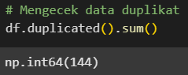

# 🚀 Laporan Proyek Machine Learning - Ferdian Sakti

## 📚 Domain Proyek: Human Activity Recognition (HAR)

Pada tahun 2022, peneliti di **King Saud University, Riyadh** mengembangkan sistem **Human Activity Recognition (HAR)** menggunakan sensor bawaan smartphone. Fokusnya adalah membedakan dua aktivitas dasar:

- 🧍 **Berdiri diam (Standing/Stop)**
- 🚶 **Berjalan (Walking)**

Meski terdengar sederhana, klasifikasi aktivitas ini adalah **fondasi penting** bagi banyak aplikasi cerdas, seperti:

- Sistem pemantauan kesehatan (health monitoring)
- Aplikasi kebugaran (fitness tracking)
- Asisten pribadi berbasis AI

Dengan hanya menggunakan **data dari accelerometer dan gyroscope**, kita dapat membangun **model machine learning** yang memahami aktivitas pengguna secara **real-time**.

---

## 🎯 Business Understanding

### ❓ Problem Statements

- Algoritma machine learning apa yang **paling optimal** untuk tugas ini dari segi **akurasi dan efisiensi prediksi**?

### 🎯 Goals

- 🧠 Membandingkan beberapa **algoritma machine learning** untuk menemukan model terbaik dari sisi performa.

## 🧪 Strategi & Solusi

### ⚙️ Algoritma yang Digunakan

Beberapa model machine learning diterapkan untuk klasifikasi:

| No. | Algoritma                | Catatan              |
|-----|--------------------------|-----------------------|
| 1   | Logistic Regression      | Sebagai baseline      |
| 2   | Support Vector Machine   | Margin-based model    |
| 3   | Decision Tree            | Interpretable         |
| 4   | Random Forest            | Ensembled decision    |
| 5   | XGBoost                  | Gradient boosting     |

### 📊 Evaluasi Model

Setiap model dievaluasi berdasarkan metrik berikut:

- 📈 **Akurasi**
- 🎯 **Precision & Recall**
- ⚖️ **F1-Score**
- 🕒 **Waktu inferensi**
- 🔁 **Kemampuan generalisasi** (via cross-validation)

### 🔧 Hyperparameter Tuning

Model terbaik (✅ **Random Forest**) disetel menggunakan **GridSearchCV** untuk:

- Meningkatkan **akurasi prediksi**
- Menjaga **stabilitas model**
- Menghindari **overfitting**

### ✅ Validasi dan Seleksi Model

Setiap model divalidasi menggunakan:

- 🔄 **Cross-Validation** → mengukur performa generalisasi
- 🔢 **Confusion Matrix** → mengecek TP, TN, FP, FN
- 📉 **ROC Curve & ROC-AUC** → jika model mendukung probabilitas output

---

## 📊 Data Understanding

Dataset yang digunakan dalam proyek ini berasal dari penelitian yang dilakukan pada tahun 2022 di King Saud University, Riyadh. Penelitian ini bertujuan untuk mengenali aktivitas manusia berdasarkan data sensor IMU (Inertial Measurement Unit) dari smartphone, yaitu **Accelerometer** dan **Gyroscope**. Dataset ini bersumber dari UCI Machine Learning Repository:

🔗 [UCI Dataset - Accelerometer Gyro Mobile Phone](https://archive.ics.uci.edu/dataset/755/accelerometer+gyro+mobile+phone+dataset)

### 🎯 Target Aktivitas yang Diklasifikasikan:

- `0` = **Standing (Stop)** – pengguna sedang berdiri diam  
- `1` = **Walking** – pengguna sedang berjalan

Dataset ini sangat cocok untuk proyek klasifikasi aktivitas berbasis gerakan, terutama untuk dua aktivitas dasar yang sering dijadikan acuan dalam sistem pemantauan kesehatan dan kebugaran.

### 📁 Deskripsi Fitur Dataset

| Nama Fitur   | Tipe Data | Deskripsi                                                                 |
|--------------|-----------|---------------------------------------------------------------------------|
| `timestamp`  | Object  | Waktu pencatatan data *(tidak digunakan dalam analisis karena tidak informatif)* |
| `accX`       | Float     | Nilai percepatan pada sumbu X (Accelerometer)                             |
| `accY`       | Float     | Nilai percepatan pada sumbu Y (Accelerometer)                             |
| `accZ`       | Float     | Nilai percepatan pada sumbu Z (Accelerometer)                             |
| `gyroX`      | Float     | Nilai rotasi sudut pada sumbu X (Gyroscope)                               |
| `gyroY`      | Float     | Nilai rotasi sudut pada sumbu Y (Gyroscope)                               |
| `gyroZ`      | Float     | Nilai rotasi sudut pada sumbu Z (Gyroscope)                               |
| `Activity`   | Integer   | Label aktivitas: `0` = Standing, `1` = Walking                            |

### Info Dataset

- Jumlah Total Baris (Data/Entitas): 31.991
- Jumlah Total Kolom (Fitur/Variabel): 8
- Tipe data sudah sesuai untuk fitur numerik (float64) dan label (int64).

### Statistik deskriptif pada Dataset

Distribusi data sensor accelerometer dan gyroscope menunjukkan karakteristik yang khas sesuai dengan fungsi masing-masing sensor. Untuk sensor **accelerometer**, pada sumbu **accX**, nilai rata-rata mendekati nol (mean = 0.024) dengan deviasi standar sebesar 0.741 dan rentang nilai cukup lebar dari -3.673 hingga 4.679, menunjukkan variasi gerakan yang besar dan kemungkinan adanya outlier atau gerakan ekstrem. Distribusi nilai pada sumbu ini juga cenderung simetris (median ≈ mean). Sumbu **accY** memiliki rata-rata positif (mean = 2.154) dan deviasi standar 1.085, menandakan dominasi nilai positif yang kemungkinan dipengaruhi oleh gravitasi atau orientasi perangkat, dengan rentang yang luas dari -4.386 hingga 6.377. Sementara itu, sumbu **accZ** menunjukkan rata-rata yang tinggi (mean = 9.538) dan deviasi standar 2.056, konsisten dengan pengaruh gravitasi bumi (\~9.8 m/s²), serta rentang nilai dari 4.296 hingga 17.592 yang menunjukkan perubahan percepatan saat perangkat bergerak. Untuk **sensor gyroscope**, ketiga sumbu **gyroX**, **gyroY**, dan **gyroZ** memiliki rata-rata mendekati nol (sekitar -0.004 hingga -0.007) dan deviasi standar kecil (antara 0.249 hingga 0.308), menandakan fluktuasi rotasi yang stabil, meskipun terdapat nilai ekstrem (misalnya gyroZ dari -1.894 hingga 1.482) yang mencerminkan adanya gerakan rotasional tiba-tiba. Insight penting dari analisis ini adalah adanya **outlier potensial**, seperti pada accY (min = -4.386 sedangkan Q1 = 1.413), serta perbedaan pola distribusi antara sensor percepatan (accelerometer) dan rotasi (gyroscope), di mana accelerometer cenderung memiliki variasi yang lebih besar. Selain itu, **ketidakseimbangan kelas** (misalnya jumlah data 'Walk' lebih banyak daripada 'Stand') dapat berpengaruh terhadap performa model klasifikasi karena model cenderung bias terhadap kelas mayoritas.

## 🧪 Univariate Analysis

### 🔍 **Distribusi Kelas Aktivitas**

Distribusi data menunjukkan ketimpangan yang mencolok: aktivitas **Walk** jauh lebih sering muncul dibandingkan **Stand**. Ketidakseimbangan ini penting diperhatikan karena dapat memengaruhi performa model klasifikasi yang sensitif terhadap distribusi label.

### 📊 **Visualisasi Distribusi Fitur Numerik**

Histogram masing-masing fitur numerik memperlihatkan karakteristik yang unik:

- **accX** memiliki distribusi simetris di sekitar nol, menandakan kestabilan gerakan lateral.
- **accY** miring ke kiri, dengan konsentrasi nilai di sekitar 2.
- **accZ** dominan di kisaran 9–11, mencerminkan pengaruh gravitasi.
- **gyroX** dan **gyroY** cenderung terpusat tajam di nol, mengindikasikan rotasi yang stabil.

Secara umum, data dari sensor **gyroscope** terlihat lebih stabil dan terpusat, sedangkan **accelerometer** lebih dinamis dan tersebar.

### 📦 **Boxplot: Deteksi Outlier**

Boxplot untuk keenam fitur numerik mengungkap keberadaan **outlier** di hampir setiap fitur:

- Fitur seperti **accX**, **accY**, dan semua fitur **gyroscope** menunjukkan outlier di kedua sisi, kemungkinan akibat pergerakan mendadak atau **noise** dari sensor.
- **accZ** memiliki sebaran yang lebih lebar, menunjukkan dinamika vertikal yang lebih tinggi.

Outlier ini tidak selalu berarti data error, namun bisa menjadi sinyal dari kejadian penting dalam aktivitas fisik.

## 🔁 Bivariate Analysis

### 📈 **Rata-Rata Fitur per Aktivitas**

Dari grafik rata-rata fitur per aktivitas:

- Sensor **accelerometer** (terutama **accY** dan **accZ**) menunjukkan perbedaan yang cukup jelas antara **Stand** dan **Walk**.
- Sensor **gyroscope** (gyroX, gyroY, gyroZ) menunjukkan nilai rata-rata yang mirip antar aktivitas, sehingga mungkin kurang relevan untuk klasifikasi.

Hal ini menandakan bahwa fitur dari accelerometer lebih informatif dalam membedakan aktivitas fisik.

### 🎻 **Violin Plot: Perbandingan Distribusi antar Aktivitas**

Violin plot memperlihatkan distribusi **accZ** untuk dua aktivitas:

- **Walk** menunjukkan variasi nilai yang lebar dan menyebar.
- **Stand** lebih terkonsentrasi dalam rentang sempit.

Ini sesuai ekspektasi, karena berjalan menimbulkan perubahan percepatan lebih besar dibanding berdiri. Fitur **accZ** tampaknya menjadi indikator potensial dalam membedakan aktivitas.

### 🔗 **Korelasi antar Fitur**

Peta korelasi menunjukkan bahwa:

- Sebagian besar fitur sensor memiliki **korelasi lemah** satu sama lain dan terhadap label **Activity** (nilai tertinggi hanya -0.13).
- Ini berarti tidak ada fitur tunggal yang sangat dominan.
- Namun, rendahnya korelasi antar fitur dapat menguntungkan model machine learning karena meminimalkan **redundansi informasi**.

## 🔀 Multivariate Analysis

### 🔎 **Pairplot untuk Subset Fitur**

Pairplot antara **accX**, **accY**, **accZ**, dan **gyroX** memperlihatkan:

- Titik-titik data dari dua aktivitas tampak tumpang tindih.
- Meski begitu, pola distribusi **accY** dan **accZ** sedikit berbeda, membuka peluang untuk pemisahan kelas dengan pendekatan non-linear.

### 🧬 **PCA: Visualisasi Reduksi Dimensi**

Visualisasi **Principal Component Analysis (PCA)** memetakan data berdimensi tinggi ke dua dimensi utama:

- Aktivitas **Stand** (biru) mendominasi ruang proyeksi.
- Aktivitas **Walk** (merah) muncul terbatas dan terpisah.

Hal ini bisa disebabkan oleh:
- Jumlah data Walk yang lebih sedikit.
- Fitur yang belum cukup kuat membedakan aktivitas dalam ruang dua dimensi.

PCA memberikan gambaran awal struktur data, namun memerlukan pendekatan tambahan untuk klasifikasi yang optimal.

### 🧾 **Deskripsi Fitur Dataset**

Dataset ini berisi enam fitur numerik yang diperoleh dari dua jenis sensor:

- **Accelerometer**: `accX`, `accY`, `accZ`
- **Gyroscope**: `gyroX`, `gyroY`, `gyroZ`

Setiap baris merepresentasikan data sensor dari satu waktu pengamatan. Label target terdiri dari dua kategori:

- **0**: Stand (berdiri)
- **1**: Walk (berjalan)

Fitur-fitur ini menjadi dasar eksplorasi untuk membangun model klasifikasi aktivitas berbasis data sensor gerakan.

---

## 🧹 Data Preparation  

### 🧹 1. Pembersihan Kolom Timestamp

Kolom `timestamp` dibuang karena tidak berkontribusi langsung pada proses prediksi.

### 🧹 2. Mengecek dan menghapus data duplikat

Dari hasil pengecekan terdapat 144 data duplikat, karena jumlahnya yang kecil maka diputuskan untuk dihapus.

### 🎯 3. Pemisahan Fitur dan Target

- **`X`**: Berisi seluruh kolom fitur, yaitu data input yang akan digunakan oleh model machine learning.  
- **`y`**: Berisi kolom target yaitu label **`Activity`**, yang merupakan variabel yang ingin diprediksi (misalnya: *Stand* atau *Walk*).  

Pemisahan ini sangat penting untuk memastikan bahwa proses pelatihan model hanya menggunakan data input, tanpa “mengintip” label target yang ingin diprediksi.

### ✂️ 4. Split Data: Training dan Testing

Fungsi `train_test_split` digunakan untuk membagi data menjadi dua bagian utama:

- **`X_train`, `y_train`**: Digunakan untuk *melatih model*.
- **`X_test`, `y_test`**: Digunakan untuk *mengukur performa model*.

Parameter penting:

- `test_size=0.2`: Mengalokasikan 20% data untuk pengujian.
- `random_state=42`: Menjamin hasil pembagian data yang konsisten saat kode dijalankan berulang kali.
- `stratify=y`: Memastikan proporsi kelas target tetap seimbang di data training dan testing, sangat berguna ketika data tidak seimbang (*imbalanced dataset*).

### ⚖️ 5. Normalisasi Fitur (Standardisasi)

Proses standardisasi dilakukan menggunakan `StandardScaler()` dari scikit-learn. Tujuannya adalah untuk mengubah skala fitur sehingga memiliki **rata-rata = 0** dan **standar deviasi = 1**, menggunakan rumus berikut:

Di mana:
- **𝑥**: Nilai asli fitur  
- **𝜇 (mu)**: Rata-rata dari data pelatihan  
- **𝜎 (sigma)**: Standar deviasi dari data pelatihan  

Berikut snippet code pada bagian standar scaler data preparation:

Langkah-langkah:
- `scaler.fit_transform(X_train)`:
  - **`fit`**: Menghitung rata-rata dan standar deviasi dari data pelatihan.
  - **`transform`**: Menerapkan standardisasi ke data pelatihan.
- `scaler.transform(X_test)`:
  - Menerapkan transformasi yang sama ke data pengujian, **menggunakan parameter dari data pelatihan**.

🔒 Hal ini sangat penting untuk **menghindari data leakage**, yaitu kondisi di mana informasi dari data uji secara tidak sengaja terbawa ke dalam proses pelatihan, yang dapat menyebabkan model tampak lebih akurat daripada kenyataannya.

---

## 🧠 Data Modeling

### 🛠️ Tahapan Pemodelan Machine Learning:

1. 📊 **Eksplorasi Awal**  
   Dataset dibaca dan dianalisis untuk memahami struktur dan karakteristiknya, termasuk jumlah data, tipe data, serta statistik deskriptif.

2. 🧹 **Praproses Data**  
   Data diproses dengan menghapus duplikasi dan kolom yang tidak relevan seperti `timestamp`, serta dilakukan standarisasi untuk memastikan semua fitur berada pada skala yang sama.

3. 📈 **Analisis Univariat & Bivariat**  
   Dilakukan analisis univariat dan bivariat untuk memahami distribusi data, korelasi fitur, serta perbedaan antar aktivitas (*Stand* dan *Walk*).

4. 🧪 **Pelatihan Model**  
   Setelah data siap, dilakukan splitting data menjadi data pelatihan dan pengujian. Beberapa model machine learning seperti:
   - **Logistic Regression**
   - **SVM**
   - **Decision Tree**
   - **Random Forest**
   - **XGBoost**  
   
   dilatih dan dievaluasi menggunakan metrik seperti:
   - `Accuracy`
   - `ROC AUC`
   - `Precision`
   - `Recall`
   - `F1-Score`

5. ⚙️ **Optimasi Model**  
   Untuk meningkatkan performa, dilakukan **validasi silang (cross-validation)** dan **hyperparameter tuning** pada model terbaik (Random Forest).  
   Kurva **ROC** digunakan untuk membandingkan kemampuan diskriminasi antar model.

6. 💾 **Penyimpanan Model**  
   Akhirnya, model terbaik beserta `scaler` disimpan untuk keperluan deployment atau penggunaan lebih lanjut.

### 🔍 Penjelasan Parameter & Nilai yang Digunakan

*Berikut akan dijelaskan masing-masing parameter dan nilai yang digunakan dalam pelatihan setiap model, untuk membantu interpretasi dan replikasi proses pemodelan.*

**1. Logistic Regression**

Logistic Regression merupakan model klasifikasi biner yang memprediksi probabilitas suatu instance termasuk dalam kelas tertentu menggunakan fungsi logistik (sigmoid). Model ini bekerja dengan:

1. Membentuk persamaan linear:
z = w₀ + w₁x₁ + w₂x₂ + ... + wₙxₙ
di mana w adalah bobot dan x adalah fitur input.

2. Mengubah output z menjadi probabilitas dengan fungsi sigmoid:
P(y=1) = 1 / (1 + e⁻ᶻ).

3. Jika P(y=1) ≥ 0.5, instance diklasifikasikan sebagai kelas 1; sebaliknya, kelas 0.

Berikut snippet code yang ada notebook :

Pembahasan Parameter
- max_iter=1000 (non-default):
- Jumlah maksimum iterasi untuk optimasi. Pada dataset besar atau kompleks, iterasi lebih banyak diperlukan agar model mencapai konvergensi.

Fungsi Evaluasi:
- Melatih model lr pada data latih (X_train_scaled, y_train)
- Menguji model pada data uji (X_test_scaled, y_test)
- Menampilkan atau menyimpan hasil evaluasi model dengan label "Logistic Regression".

Kelebihan:
- Cepat dan efisien untuk dataset kecil.
- Output probabilitas yang interpretable.

Kekurangan:
- Hanya menangkap hubungan linier antar fitur.
- Sensitif terhadap data tidak seimbang (terlihat dari recall kelas minoritas 4%).

**2. Support Vector Machine (SVM)**

SVM mencari hyperplane optimal yang memisahkan dua kelas dengan margin terlebar. Pada kasus ini digunakan SVC (Support Vector Classification) dengan kernel linear:
- Memetakan data ke ruang dimensi tinggi (jika menggunakan kernel non-linear).
- Menemukan hyperplane dengan margin maksimal yang memisahkan kelas "berdiri" dan "berjalan".
- Data titik terdekat ke hyperplane disebut support vectors.

Berikut snippet code yang ada notebook :

Pembahasan Parameter:

- class_weight='balanced' (non-default):

Memberikan bobot lebih besar pada kelas minoritas untuk menangani ketidakseimbangan data.
- probability=True (opsional, menambah komputasi)

Digunakan agar model bisa mengeluarkan nilai probabilitas prediksi, bukan hanya label kelas.

Dibutuhkan untuk metrik tertentu seperti ROC AUC.

Parameter default lainnya:
- kernel='rbf': Kernel Radial Basis Function (default untuk kasus non-linear).
- C=1.0: Parameter penalti untuk kesalahan klasifikasi.
- gamma='scale': Koefisien kernel (default dihitung berdasarkan skala fitur).

Fungsi Evaluasi:

Fungsi evaluate_model dipakai untuk melatih model dan menguji performanya seperti akurasi, precision, recall, F1-score, dan mungkin confusion matrix, dengan label "SVM Balanced" untuk membedakan hasilnya dari model lain.

Kelebihan:
- Efektif pada data dimensi tinggi.
- Dapat menangani hubungan non-linear dengan kernel.

Kekurangan:
- Komputasi lebih lambat dibanding Logistic Regression.
- Kurang efisien untuk dataset sangat besar.

**3. Decision Tree**

Decision Tree membangun struktur pohon dengan membagi data secara rekursif berdasarkan fitur yang memberikan pemisahan terbaik:
- Memilih fitur untuk split menggunakan kriteria (default: Gini impurity).
- Membagi data menjadi subset yang lebih homogen.
- Proses berlanjut hingga mencapai kedalaman maksimum atau kriteria berhenti lainnya.

Berikut snippet code yang ada notebook :

Parameter:

random_state=42
- Fungsi: Mengontrol randomness saat split node
- Nilai: 42 (seed acak untuk reproduktibilitas hasil)

Parameter default:
1. criterion='gini': Mengukur kualitas split (alternatif: 'entropy')
2. max_depth=None: Kedalaman pohon tidak dibatasi
3. min_samples_split=2: Minimum sampel yang diperlukan untuk split node
4. min_samples_leaf=1: Minimum sampel di leaf node

Fungsi Evaluasi:

Fungsi evaluate_model digunakan untuk:
- Melatih model dt menggunakan data pelatihan (X_train, y_train)
- Menguji model menggunakan data uji (X_test, y_test)
- Memberi label hasil evaluasi sebagai "Decision Tree"

Kelebihan:
- Mudah diinterpretasikan secara visual
- Tidak memerlukan preprocessing ekstensif

Kekurangan:
- Rentan overfitting
- Sensitif terhadap perubahan kecil dalam data

**4. Random Forest Classifier**

Random Forest adalah ensemble method yang menggabungkan banyak Decision Tree:
- Membangun multiple Decision Tree dengan teknik bagging (Bootstrap Aggregating).
- Setiap tree dilatih pada subset data dan fitur yang diambil secara acak.
- Hasil prediksi ditentukan oleh voting mayoritas dari semua tree.

Berikut snippet code yang ada notebook :

Parameter:

random_state=42
- Fungsi: Mengatur seed acak agar proses pembentukan hutan (kumpulan decision tree) dapat direproduksi (hasilnya konsisten saat dijalankan ulang).
- Nilai 42: Angka acak yang umum digunakan untuk konsistensi eksperimen, bisa diganti dengan angka lain.

Parameter default:
- n_estimators=100: Jumlah tree dalam forest.
- max_depth=None: Kedalaman maksimum tree (tidak dibatasi).
- min_samples_split=2: Minimum sampel yang diperlukan untuk memisahkan node.

Fungsi Evaluasi:

Fungsi evaluate_model digunakan untuk:
- Melatih model rf pada data pelatihan (X_train, y_train)
- Menguji performa pada data uji (X_test, y_test)
- Menampilkan hasil evaluasi seperti akurasi, precision, recall, F1-score dengan label "Random Forest"

Kelebihan:
- Robust terhadap overfitting.
- Dapat menangani hubungan non-linear dan interaksi fitur.

Kekurangan:
- Kurang interpretable dibanding model linear.
- Komputasi lebih berat untuk jumlah tree besar.

**5. XGBoost**

XGBoost (Extreme Gradient Boosting) adalah algoritma ensemble yang menggunakan teknik boosting:
1. Membangun model prediktif secara berurutan.
2. Setiap model baru mengoreksi kesalahan model sebelumnya.
3. Menggunakan gradient descent untuk meminimalkan loss function.

Berikut snippet code yang ada notebook :

Parameter:

- n_estimators=100: Jumlah pohon dalam model
- learning_rate=0.3: Langkah pembelajaran (shrinkage)
- max_depth=6: Kedalaman maksimum pohon
- eval_metric='logloss': Metrik evaluasi untuk klasifikasi biner

random_state=42
- Fungsi: Menetapkan seed acak untuk menjamin reproducibility (hasil model tetap sama tiap kali dijalankan).
- Nilai 42: Angka acak umum digunakan dalam eksperimen, bisa diganti.

Fungsi Evaluasi:

Fungsi evaluate_model digunakan untuk:
- Melatih model xgb dengan data pelatihan (X_train, y_train)
- Menguji performanya dengan data uji (X_test, y_test)
- Memberi label "XGBoost" untuk membedakan output hasil evaluasi

Kelebihan:
- Performa tinggi dengan data kompleks
- Memiliki mekanisme regularisasi bawaan

Kekurangan:
- Lebih kompleks dan kurang interpretable
- Membutuhkan tuning parameter yang lebih hati-hati

### Hyperparameter Tuning

Proses improvement model dilakukan dengan menggunakan GridSearchCV untuk mencari kombinasi hyperparameter terbaik pada Random Forest. Parameter yang diuji meliputi jumlah pohon (n_estimators) sebanyak 50 dan 100, kedalaman maksimum pohon (max_depth) yang bisa None, 10, atau 20, serta jumlah minimum sampel untuk membagi node (min_samples_split) sebesar 2 dan 5. GridSearchCV melakukan pencarian menyeluruh pada kombinasi parameter ini dengan validasi silang 5-fold untuk memastikan model tidak overfit dan mampu generalisasi dengan baik, menggunakan metrik akurasi sebagai ukuran performa. Setelah menemukan konfigurasi terbaik, model yang dihasilkan (best_rf) kemudian dievaluasi kembali pada data training dan testing untuk mengukur peningkatan performa akibat tuning hyperparameter tersebut.

Berikut best parameter hasil hyperparameter tuning:

Penjelasan Hasil Best Parameter Tuning Random Forest:
1. Parameter Terbaik:
- max_depth=20: Setiap pohon dalam hutan (forest) hanya boleh tumbuh sampai kedalaman maksimal 20 level.
- min_samples_split=5: Node hanya akan split jika memiliki minimal 5 sampel.
- n_estimators=100: Menggunakan 50 pohon dalam ensemble.

2. Hasil Performa:
- Akurasi: 98.4% (sangat tinggi)
- ROC AUC: 0.922 (baik)
- Precision Class 0: 0.82 (baik)
- Recall Class 0: 0.12 (rendah)

### Evaluation

Cross-validation adalah teknik evaluasi model machine learning yang membagi dataset menjadi beberapa subset (folds) secara bergantian untuk melatih dan menguji model. Metode ini memberikan estimasi performa yang lebih stabil dan andal dibandingkan hanya sekali melakukan train-test split. Berikut adalah hasil cross-validation untuk model-model yang digunakan:

**Random Forest** terpilih sebagai model terbaik dengan skor cross-validation tertinggi sebesar **0.9839 ± 0.0008**. Ini menunjukkan performa prediksi yang paling akurat dan konsisten dibandingkan model lain seperti Logistic Regression, Linear SVM, Decision Tree, dan XGBoost. Keunggulan Random Forest juga terletak pada mekanisme ensembel-nya yang menggabungkan banyak pohon keputusan, sehingga lebih tahan terhadap overfitting dan mampu menangkap pola kompleks dengan stabil. Kombinasi antara akurasi tinggi dan kestabilan hasil inilah yang membuat Random Forest menjadi pilihan utama dalam konteks ini.

---

### ROC Curve

ROC Curve (Receiver Operating Characteristic Curve) adalah grafik evaluasi performa model klasifikasi yang memplot **True Positive Rate (TPR)** terhadap **False Positive Rate (FPR)** pada berbagai threshold klasifikasi. Kurva ini membantu menilai seberapa baik model membedakan antara kelas positif dan negatif.

Berikut visualisasi ROC Curve untuk model-model yang telah dilatih:

**Kesimpulan visualisasi ROC Curve:**

1. **XGBoost** (AUC: 0.954) — Kurva paling mendekati sudut kiri atas, menunjukkan performa terbaik.
2. **Random Forest** (AUC: 0.924) — Hampir menyamai XGBoost, sangat stabil.
3. **Linear SVM** (AUC: 0.942) — Berada dibawah Random Forest.
4. **Logistic Regression** (AUC: 0.889) — Cukup baik.
5. **Decision Tree** (AUC: 0.660) — Performa paling rendah.

**Rekomendasi model berdasarkan kebutuhan:**

Pilihan Utama: XGBoost
- Alasan: AUC tinggi (0.954) + konsistensi TPR/FPR optimal di berbagai threshold.
- Kekurangan: Lebih kompleks dan butuh tuning.

Alternatif: Random Forest
- Alasan: AUC hampir setara (0.924) + lebih interpretable.
- Kekurangan: Recall kelas minoritas mungkin masih rendah.

---

### Penjelasan penggunaan kriteria evaluasi seperti akurasi, presisi (precision), recall, dan f1-score. 

Berikut adalah perhitungan untuk mendapatkan evaluasi model :
1. Akurasi adalah rasio prediksi yang benar terhadap jumlah estimasi secara keseluruhan. Rumus untuk menghitung akurasi ditunjukkan dalam Persamaan berikut:

2. Presisi (Precision) merupakan perbandingan antara jumlah prediksi positif yang tepat dengan keseluruhan hasil prediksi positif. Presisi dihitung menggunakan persamaan berikut:

3. Recall adalah perbandingan antara jumlah prediksi positif dengan jumlah data positif secara keseluruhan. Recall dihitung menggunakan persamaan berikut:

4. F1-score adalah suatu bentuk keseimbangan yang menggabungkan akurasi dan recall dalam sebuah sistem. Ini merupakan nilai rata-rata harmonis antara presisi dan recall. F1-score dihitung menggunakan persamaan berikut:

---

## 📈 Ringkasan Performa Model

Berikut adalah rangkuman semua metrik evaluasi model dalam satu tabel:

---

## 📊 Poin-Poin Penting:

- **Sebagian besar model menunjukkan akurasi tinggi** di atas 97% untuk XGBoost, Random Forest, Logistic Regression, dan Decision Tree, artinya mereka mampu memprediksi sebagian besar data dengan tepat. SVM sedikit lebih rendah (sekitar 81%), mungkin karena karakteristik algoritmanya.  
- **Kelas minoritas (Class 0) sulit dideteksi dengan baik** oleh hampir semua model kecuali Linear SVM.
- **Kelas mayoritas (Class 1) diprediksi dengan sangat baik** oleh semua model dengan akurasi di atas 98%.  
- **Beberapa model menunjukkan tanda overfitting**, seperti Random Forest dan Decision Tree yang mencapai 100% akurasi pada data latih tapi sedikit menurun di data uji. Logistic Regression dan SVM lebih stabil dan tidak terlalu overfit.

## 🎯 Evaluasi Model dalam Menjawab Problem Statement dan Goals:

1. **Akurasi Model**
- XGBoost, Random Forest, Logistic Regression, dan Decision Tree menunjukkan performa akurasi yang sangat baik (97.6%-98.4%) dalam memprediksi data secara keseluruhan.
- SVM mencatat akurasi lebih rendah (81.7%) karena fokusnya pada penanganan ketidakseimbangan kelas.
2. **Deteksi Kelas Minoritas (Stand)**
- Sebagian besar model (XGBoost, Random Forest, Logistic Regression) menunjukkan kesulitan mendeteksi kelas Stand (Recall 3.5%-23.7%).
- Decision Tree menunjukkan performa moderat (Recall 33.3%).
- SVM unggul dalam mendeteksi kelas Stand (Recall 90.4%) namun menghasilkan banyak false positive (Presisi hanya 8.2%).
3. **Deteksi Kelas Mayoritas (Walk)**
- Semua model (kecuali SVM) menunjukkan kemampuan sangat baik dalam mendeteksi kelas Walk (Recall >98%).
4. **Overfitting**
- Random Forest dan Decision Tree menunjukkan tanda overfitting dengan akurasi training sempurna (100%) yang turun pada data testing.
- Logistic Regression dan SVM tidak menunjukkan overfitting, dengan performa yang stabil antara training dan testing.

### ***Rekomendasi***
1. Untuk aplikasi yang memprioritasi akurasi keseluruhan: XGBoost atau Random Forest.
2. Untuk deteksi kelas Stand yang kritis: SVM dengan pertimbangan false positive yang tinggi.
3. Perlu penanganan ketidakseimbangan data (oversampling, class weighting) untuk meningkatkan performa kelas minoritas.

Hasil komparasi lima algoritma menunjukkan XGBoost sebagai model terbaik secara keseluruhan, sementara SVM Balanced unggul dalam deteksi berdiri dengan recall 90% meski dengan akurasi lebih rendah (81.81%). Hal ini memberikan fleksibilitas pemilihan model berdasarkan kebutuhan bisnis yang spesifik. XGBoost untuk aplikasi yang memprioritaskan akurasi keseluruhan, atau SVM Balanced untuk sistem yang membutuhkan sensitivitas tinggi terhadap aktivitas diam.

## 🏁 Kesimpulan:

Goals berhasil tercapai:  
(1) sistem klasifikasi berbasis sensor smartphone dengan akurasi >95% telah dikembangkan, dan  
(2) Membuat perbandingan algoritma memberikan landasan ilmiah untuk pemilihan model.

Solusi yang diusulkan memiliki dampak bisnis nyata: implementasi XGBoost pada aplikasi kesehatan dapat meningkatkan akurasi pelacakan aktivitas, sementara teknik oversampling atau threshold adjustment dapat mengatasi keterbatasan recall kelas minoritas untuk penggunaan spesifik seperti penghematan baterai. Rekomendasi ini menunjukkan pendekatan yang komprehensif, tidak hanya memenuhi kriteria teknis tetapi juga mempertimbangkan berbagai skenario bisnis potensial.

---

## Menyimpan model terbaik untuk digunakan deployment kedepannya
joblib.dump(best_model, 'best_model.pkl')

joblib.dump(scaler, 'scaler.pkl')

## Daftar Referensi
🔗 [Anguita, D., Ghio, A., Oneto, L., Parra, X., & Reyes-Ortiz, J. L. (2013). Human Activity Recognition on Smartphones using Accelerometer and Gyroscope. IEEE International Conference on Computational Intelligence and Virtual Environments for Measurement Systems and Applications .](https://www.semanticscholar.org/paper/A-Public-Domain-Dataset-for-Human-Activity-using-Anguita-Ghio/83de43bc849ad3d9579ccf540e6fe566ef90a58e)

🔗 [Human Activity Recognition Using Smartphones | UCI Dataset](https://archive.ics.uci.edu/dataset/240/human+activity+recognition+using+smartphones)

